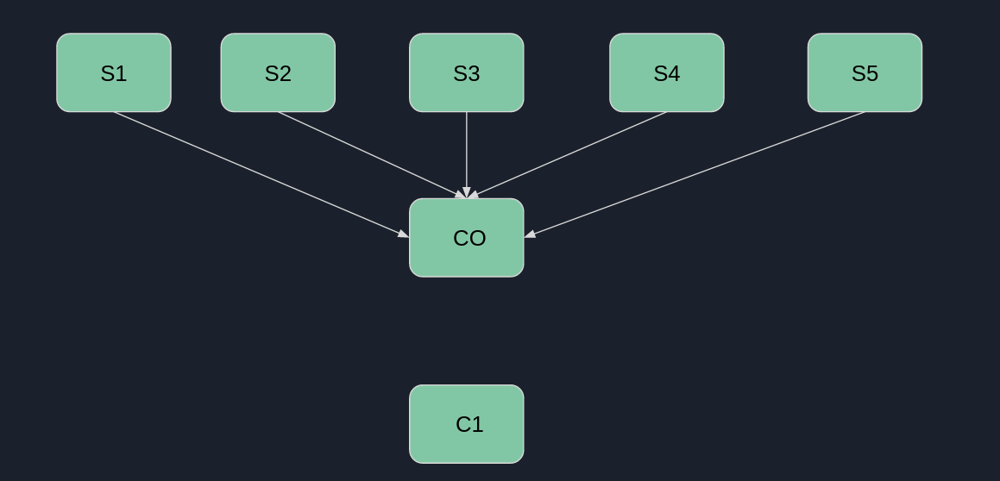
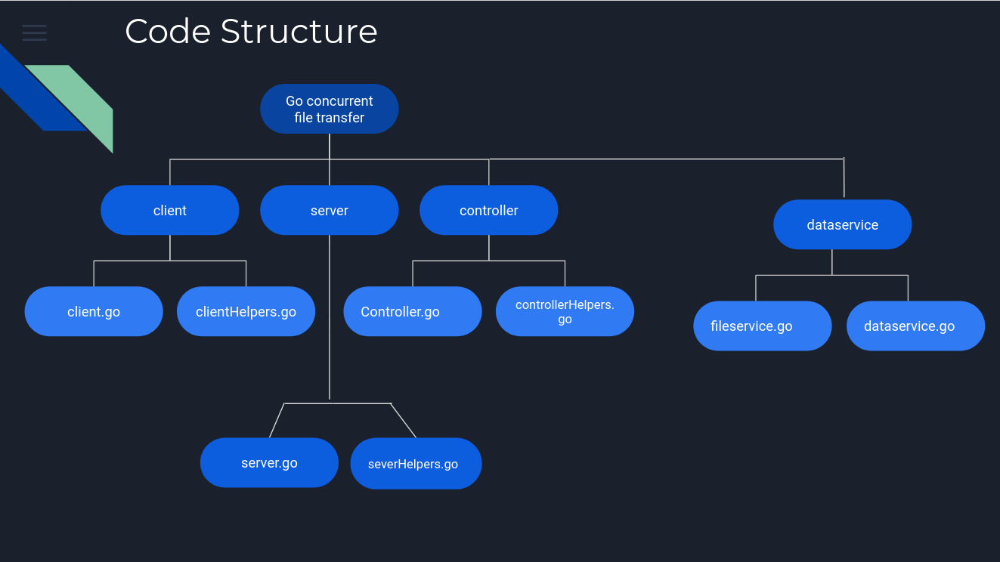
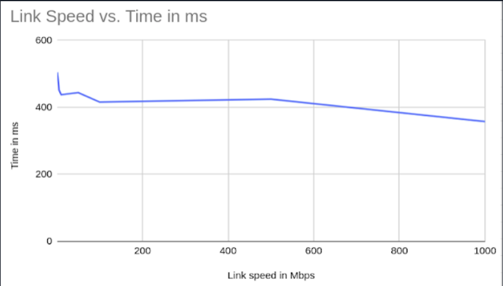

# Concurrent File transfer Using Golang  
As a part of CS301 Operating Systems course

---

## Problem Statement

Build a Client-Server system in [GO](https://github.com/golang/go) with multiple servers to download a file from. The client can request a file and get a list of servers which have this file.  
The Client can then concurrently download chunks of the requested file from the available servers concurrently.  
Use [xxhash](https://github.com/OneOfOne/xxhash) for hashing. This has to be implemented using sockets only. No HTTP.  

---

## Objectives

Important objectives we had in mind were -  

1. Client should have a single service from where it can get the addresses of servers which have the required file
2. Minimal processing at the server side to keep the chunk sending service fast
3. Concurrent download from all the available servers which have the file without blocking any download
4. Minimize RAM utilization during download as fast download speeds and slow writing speeds can result in memory shortage in the RAM
5. More amount of data to be downloaded from servers which have higher bandwidth connection with the client for more efficiency  
6. Minimize the downtime between download requests to the servers

---

## Application Logic

1. There are 3 components:
   1. The Client
   2. The Server
   3. The Controller
2. The controller is the first one to start, then all the servers connect to it and send it information of the files that they have and their listen addresses
3. The client can then connect to the controller and send the filename of the file it wants
4. The controller then sends to the client the `xxhash` of the requested file and the addresses of the servers having the file
5. The client then creates the chunk requests and puts them to a [channel](https://tour.golang.org/concurrency/2)
6. The worker threads concurrently start executing the jobs from the jobs channel and download the chunks from the servers
7. The downloaded chunks are stored in temporary files
8. The client then assembles the downloaded chunks into the final file

  

---

## Networks challenges require OS solutions

We tried to solve network related challenges using primitives taught in the OS course as this is a project for the OS course.

- There can be a scenario where the bandwidth between client and one server is very low and the bandwidth between client and other servers is high
- Using a round robin method to distribute workloads is a bad idea as the one with low bandwidth is likely to be the performance bottleneck
- Developers solve this problem by varying the chunk size proportional to the bandwidth, but we tried to do something different using Concurrency
- We kept the chunk size small, and let the worker threads take up a job from the Jobs Channel as soon as they are done with their current job of downloading a chunk
- This way, the thread associated with higher bandwidth server will end up downloading more chunks than the one associated with lower bandwidth channel

---

## Code Structure and Usage

The code structure is as shown below - 

  

USAGE - 
According to the host being a server/client/controller, build the executable. Eg for the client -  

`$ go build client.go clientHelpers.go`

Then run the executable

For the server, the files that are to be served should be in the `library` directory inside the `server` directory.

---

## Limitations

1. As we have tried to limit the RAM usage, the maximum download throughput is limited to `Number of threads * Disk concurrent write speed`
2. Having connections as fast as the disk write speed is pretty rare on the client side, but the limitation is worth mentioning

---

## Further scope of development

1. The concurrent download can be made a hybrid of buffering in the RAM and writing to the disk
2. Finding the perfect balance can limit the RAM usage to a certain extent and still have fast downloads
3. Adding an SSL layer on top of the application
4. Adding timeouts and other network related features

---

## Conclusion

The software works fine with different types of files which are not too large in size. The download speed is never bottlenecked by a single slow bandwidth connection when other connections have high bandwidth.

Testing on Mininet, we kept the bandwidth of 5 connections above the disk write speed and varied the bandwidth of 1 client to server connection.
Here are the results:

  

As we can see, the download time is not very much influenced by change in the minimum bandwidth of the multiple client-server connections.
This shows that number of chunks downloaded from each server is proportional to the bandwidth of the connection.

---